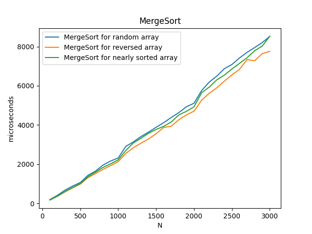
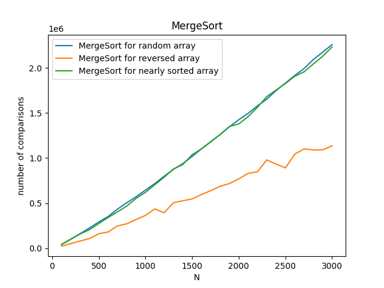
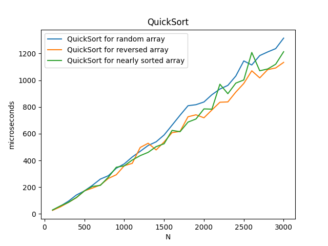
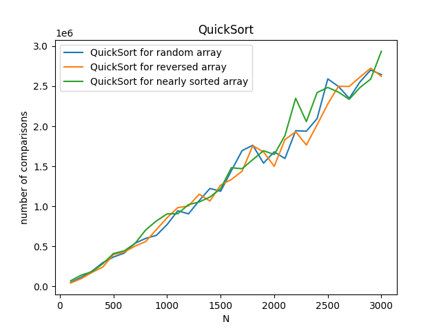
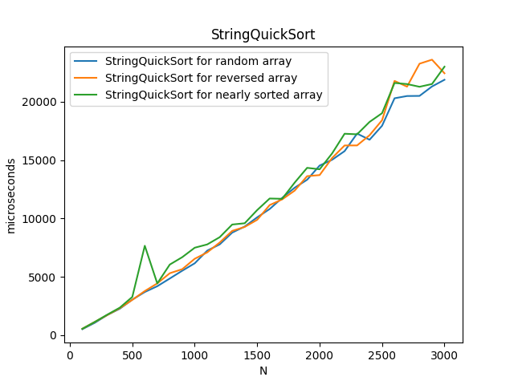
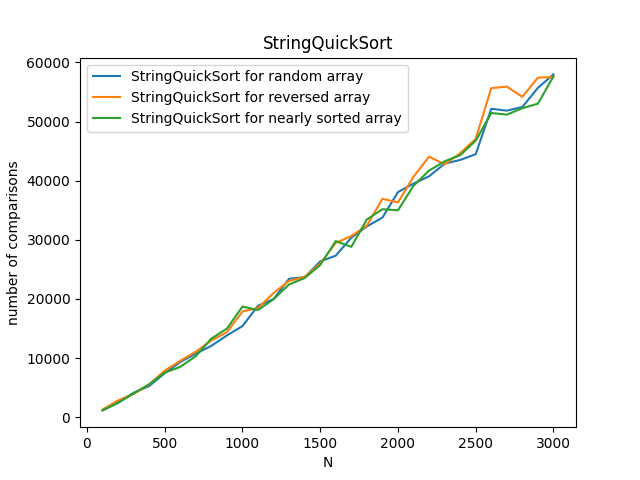
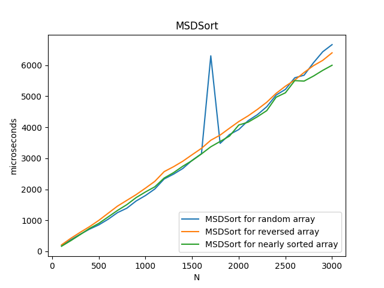
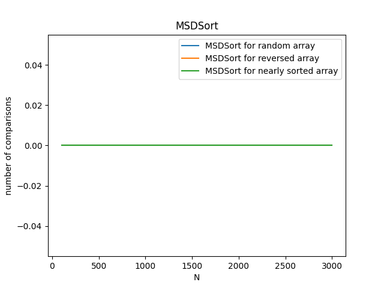
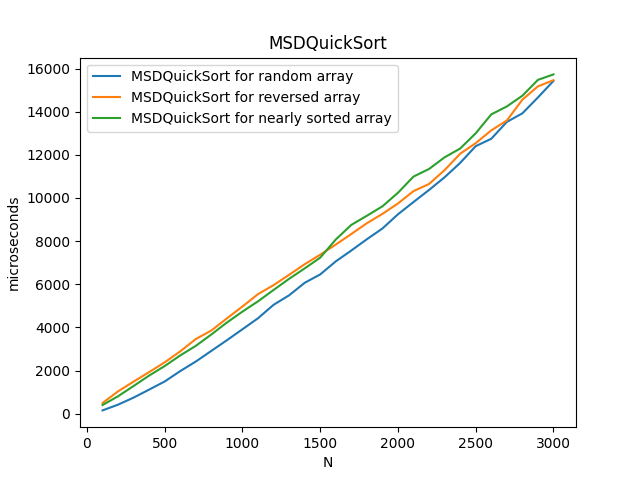

### Результаты замеров можно найти в файле average.txt

### Графики

### Выводы

- Похоже, что сортировку stringQuickSort я реализовал неправильно. Пытался использовать другой алгоритм, но не получилось.
- Такой вывод можно сделать, так как stringQuickSort работает медленнее, чем QuickSort.
- В остальном видно, что MSD работает быстрее, чем QuickSort и MergeSort.
- Предполагаю, что вариант реализации алгоритма MSD с добавлением QuickSort, начиная с некоторого размера массива, будет работать быстрее, чем MSD.
- Хотелось увидеть этот факт на графиках, но увы алгоритм QuickSort для строк не удалось реализовать оптимально.
- Так же в QuickSort для строк должно быть гораздо меньше сравнений, чем в обычной реализации. 
- В MSD как таковых посимвольных сравнений не происходит, поэтому на графике показан 0.