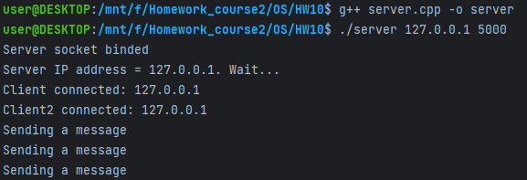
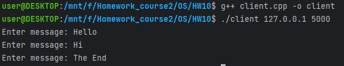
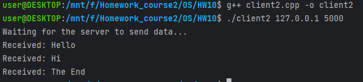

# Домашнее задание по ОС №10

## Работу выполнил
Мухин Дмитрий БПИ228

## Работа выполнена на 10 баллов

## Что сделано
- Есть сервер и два клиента
- Первый клиент отправляет сообщения серверу
- Сервер отправляет сообщения второму клиенту
- Передача сообщений происходит через TCP
- Передача завершается при вводе первым клиентом "The End"

## Пример работы

__Сервер__

__Первый клиент__

__Второй клиент__

