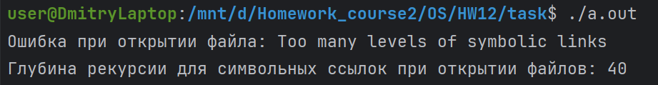
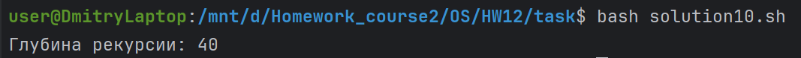

# Домашнее задание по ОС №12

## Работу выполнил
Мухин Дмитрий БПИ228

## Работа выполнена на 10 баллов

## Что сделано
- Создается файл
- На него создается ссылка
- На каждую новую ссылку создается другая ссылка
- При возникновении ошибки на экран выводится количество созданных ссылок

## Пример работы

### C++

### Bash

