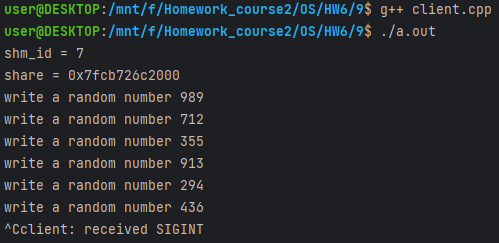
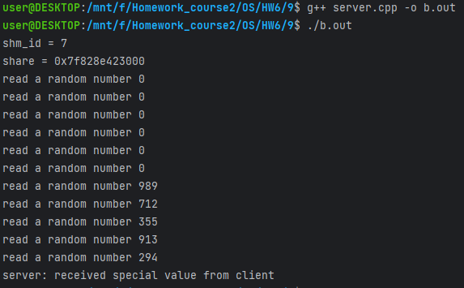

# Домашнее задание по ОС №6

## Работу выполнил

Мухин Дмитрий БПИ228

## Решение на 9 баллов

## Что сделано

- Есть два процесса: сервер и клиент
- Сервер получает от клиента случайные числа и выводит их на экран
- Клиент отправляет серверу случайные числа
- Сервер и клиент работают в бесконечном цикле
- При завершении работы клиента сервер завершает свою работу и удаляет сегмент разделяемой памяти
- Cервер узнает о завершении работы клиента через специальное значение, передаваемое в канале

## Пример работы

__Клиент__

__Сервер__
