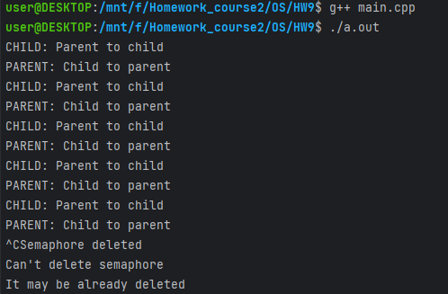

# Домашнее задание по ОС №9

## Работу выполнил
Мухин Дмитрий БПИ228

## Работа выполнена на 10 баллов

## Что сделано
- Есть родительский и дочерний процессы
- Процессы обмениваются данными через канал
- Процессы обмениваются сообщениями до тех пор, пока не будет передано прерывание с клавиатуры

## Пример работы

