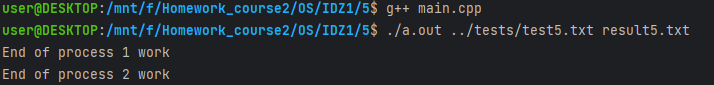

# Задание на 5 баллов

## Работу выполнил
__Мухин Дмитрий Владимирович БПИ228__

### Вариант 21
### Условие
Разработать программу, вычисляющую число вхождений различных прописных букв в заданной ASCII–строке. В выходном тексте для каждой прописной буквы вывести, сколько раз она
встретилась в обработанном тексте.

## Схема решения задачи
- Есть три процесса, которые в коде обозначены в комментариях
- Первый процесс считывает строку и отправляет ее второму процессу
- Второй процесс считывает строку из канала, вызывается функция, которая считает количество вхождений каждой буквы, результат отправляется третьему процессу
- Третий процесс считывает результат из канала и выводит его в выходной файл
- От решения на 4 балла отличается тем, что вместо неименованных каналов используются именованные
- /tmp/fifo1 - первый канал
- /tmp/fifo2 - второй канал
- mknod(fifo1, S_IFIFO | 0666, 0) - создание первого канала
- mknod(fifo2, S_IFIFO | 0666, 0) - создание второго канала

## Как запустить
