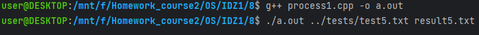

# Задание на 8 баллов

## Работу выполнил
__Мухин Дмитрий Владимирович БПИ228__

### Вариант 21
### Условие
Разработать программу, вычисляющую число вхождений различных прописных букв в заданной ASCII–строке. В выходном тексте для каждой прописной буквы вывести, сколько раз она
встретилась в обработанном тексте.

## Схема решения задачи
- Есть два процесса
- Первый отвечает за работу с файлами
- Второй отвечает за подсчет количества вхождений букв
- Они связаны с помощью двух неименованных каналов
- Первый нужен для отправки исходных данных во второй процесс
- Второй нужен для отправки результата в первый процесс
- /tmp/fifo1 - первый канал
- /tmp/fifo2 - второй канал
- mknod(fifo1, S_IFIFO | 0666, 0) - создание первого канала
- mknod(fifo2, S_IFIFO | 0666, 0) - создание второго канала
- От прошлой задачи отличается только тем, что процессы запускаются из разных файлов
- Для работы необходимо запустить два терминала, в них уже запускать программы

## Как запустить

