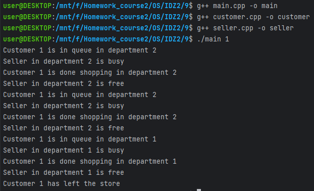

# Задание на 8 баллов

## Работу выполнил 
__Мухин Дмитрий Владимирович БПИ228__

### Вариант 13
### Условие
В магазине работают три отдела,
каждый отдел обслуживает один продавец. Покупатель, зайдя в
магазин, делает покупки в одном или нескольких произвольных
отделах, обходя их в произвольном (случайном) порядке. Если
в выбранном отделе продавец не свободен, покупатель становится
в очередь и ожидает, пока продавец не освободится.
Создать многопроцессное приложение, моделирующее рабочий день магазина.
Каждого покупателя и продавцов моделировать отдельными процессами.
Размер очереди не оговаривается. Считается, что для данной задачи она не ограничена (но моделирование должно быть в разумных
пределах).

## Схема решения задачи
- Вводится количество покупателей и имя файла для вывода
- Создается процесс для каждого покупателя
- Создается три процесса продавцов
- Каждый покупатель встает в очередь в случайном отделе
- Продавец обслуживает покупателя
- Покупатель покидает магазин или переходит в другой отдел
- Продавец обслуживает следующего покупателя
- Программа завершается, когда все покупатели покидают магазин

## Используются:
- main - создает процессы покупателей и продавцов
- seller - процесс продавца
- customer - процесс покупателя
- семафоры UNIX System V для синхронизации процессов
- очередь сообщений UNIX System V для обмена информацией между процессами

## Пример работы

