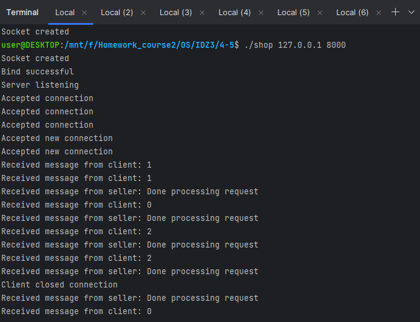
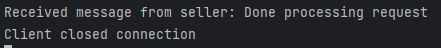
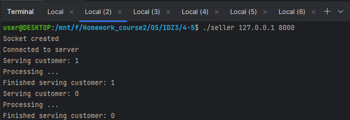
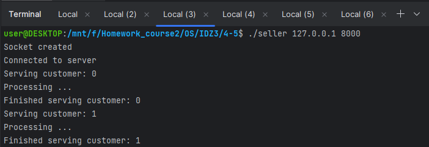
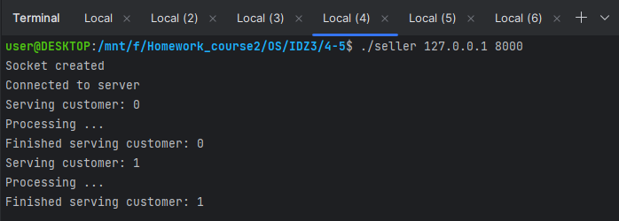
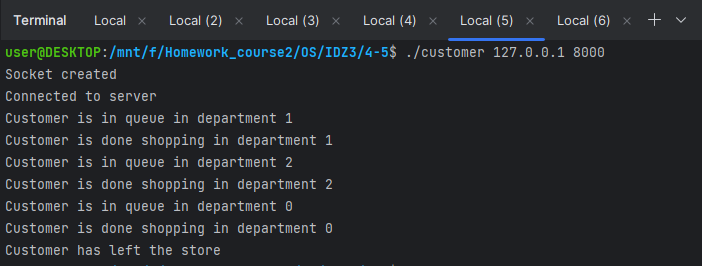
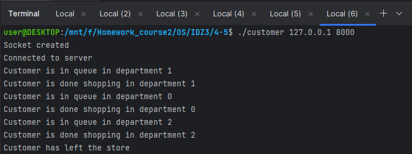

# Задание на 4-5 баллов

## Работу выполнил
__Мухин Дмитрий Владимирович БПИ228__

### Вариант 13
### Условие
В магазине работают три отдела,
каждый отдел обслуживает один продавец. Покупатель, зайдя в
магазин, делает покупки в одном или нескольких произвольных
отделах, обходя их в произвольном (случайном) порядке. Если
в выбранном отделе продавец не свободен, покупатель становится
в очередь и ожидает, пока продавец не освободится.
Создать многопроцессное приложение, моделирующее рабочий день магазина.
Каждого покупателя и продавцов моделировать отдельными процессами.
Размер очереди не оговаривается. Считается, что для данной задачи она не ограничена (но моделирование должно быть в разумных
пределах).

## Схема решения задачи
- Запускается магазин, который является сервером. Для его запуска нужно передать IP и PORT.
- Запускаются и подкдлючаются к магазину три продавца, которые являются клиентами.
- Далее запускаются и подключаются к магазину клиенты покупателей. Их может быть любое количество.
- Через некоторое время после входа в магазин покупатель встает в очередь к случайно выбранному продавцу.
- Покупатель посещает несколько продавцов и выходит из магазина.
- Программа завершается при нажатии Ctrl + C в процессе магазина. При этом все клиенты завершают свою работу.

## Пример работы

### Магазин

### Продавец 1

### Продавец 2

### Продавец 3

### Покупатель 1

 

### Покупатель 2

